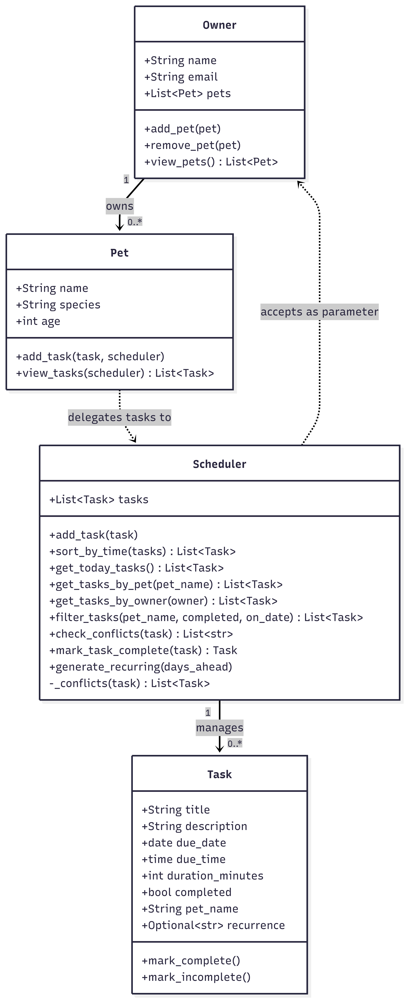
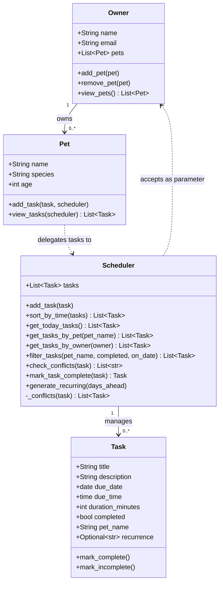

# PawPal+ (Module 2 Project)

You are building **PawPal+**, a Streamlit app that helps a pet owner plan care tasks for their pet.

## Scenario

A busy pet owner needs help staying consistent with pet care. They want an assistant that can:

- Track pet care tasks (walks, feeding, meds, enrichment, grooming, etc.)
- Consider constraints (time available, priority, owner preferences)
- Produce a daily plan and explain why it chose that plan

Your job is to design the system first (UML), then implement the logic in Python, then connect it to the Streamlit UI.

## What you will build

Your final app should:

- Let a user enter basic owner + pet info
- Let a user add/edit tasks (duration + priority at minimum)
- Generate a daily schedule/plan based on constraints and priorities
- Display the plan clearly (and ideally explain the reasoning)
- Include tests for the most important scheduling behaviors

## ✨ Features

### Core scheduling algorithms

| Feature | Method | Description |
|---------|--------|-------------|
| **Chronological sorting** | `Scheduler.sort_by_time(tasks)` | Tasks added in any order are always displayed earliest-first using a lambda sort key on `due_time`. Called automatically by `get_today_tasks()`. |
| **Smart filtering** | `Scheduler.filter_tasks(pet_name, completed, on_date)` | Single-pass filter that accepts any combination of pet name, completion status, and date. Omit a parameter to leave that dimension unfiltered. |
| **Conflict detection** | `Scheduler.check_conflicts(task)` | Returns human-readable warning strings for any time-window overlap — same pet *or* different pets (an owner can only be in one place at a time). Called on every `add_task()` and surfaced as `st.warning` in the UI. Never crashes the program. |
| **Recurring task auto-scheduling** | `Scheduler.mark_task_complete(task)` | Marks a task done and uses Python's `timedelta` to compute the next occurrence from `due_date` (not `date.today()`), so completing a task late does not silently shift the whole schedule forward. |
| **Bulk recurring expansion** | `Scheduler.generate_recurring(days_ahead)` | Pre-generates all future occurrences of daily/weekly tasks up to `days_ahead` days out. Skips dates that already exist to prevent duplicates. Uses `dataclasses.replace()` to copy all task fields safely. |

### Streamlit UI features

- **Owner setup** — enter name and email, saved across reruns via `st.session_state`
- **Pet management** — add multiple pets with name, species, and age
- **Task creation** — set title, description, due date, time, duration, and recurrence (none / daily / weekly); conflict warnings appear immediately after submitting
- **Live schedule view** — filter by pet and/or status; metric tiles show total / done / pending counts; tasks display as cards sorted chronologically
- **Mark Done button** — marks a task complete and shows which date the next occurrence was auto-scheduled

## Getting started

### Setup

```bash
python -m venv .venv
source .venv/bin/activate  # Windows: .venv\Scripts\activate
pip install -r requirements.txt
```

### Suggested workflow

1. Read the scenario carefully and identify requirements and edge cases.
2. Draft a UML diagram (classes, attributes, methods, relationships).
3. Convert UML into Python class stubs (no logic yet).
4. Implement scheduling logic in small increments.
5. Add tests to verify key behaviors.
6. Connect your logic to the Streamlit UI in `app.py`.
7. Refine UML so it matches what you actually built.

## 🖥️ Sample CLI Output

Run the demo script directly to see all scheduling algorithms in action:

```bash
python main.py
```

```
====================================================
           PawPal+ - Today's Schedule
====================================================
  Owner : Muskaan  |  muskaan@example.com
  Pets  : Biscuit, Whiskers
  Date  : 2026-07-04
====================================================

  [All tasks - sorted by time]
  [ ]  07:00  Biscuit      Morning Walk
                   30-min walk around the block

  [ ]  08:00  Biscuit      Feeding
                   1 cup of dry food, morning serving

  [ ]  09:00  Whiskers     Medication
                   Give joint supplement pill with food

  [Pending tasks only]
  [ ]  07:00  Biscuit      Morning Walk
                   30-min walk around the block

  [ ]  08:00  Biscuit      Feeding
                   1 cup of dry food, morning serving

  [ ]  09:00  Whiskers     Medication
                   Give joint supplement pill with food

  [Biscuit's tasks only]
  [ ]  07:00  Biscuit      Morning Walk
                   30-min walk around the block

  [ ]  08:00  Biscuit      Feeding
                   1 cup of dry food, morning serving

  [Adding conflicting tasks - watch for warnings]
  Warning: 'Bath' and 'Morning Walk' overlap for Biscuit
  Warning: 'Playtime' (Whiskers) and 'Morning Walk' (Biscuit) overlap - you can't do both at once
  Warning: 'Playtime' (Whiskers) and 'Bath' (Biscuit) overlap - you can't do both at once

  [Recurring task completed]
  Marked done : 'Morning Walk' on 2026-07-04
  Auto-created: 'Morning Walk' on 2026-07-05  (today + 1 day via timedelta)

====================================================
  Today: 3 task(s)  |  Done: 1  |  Pending: 2
  Tomorrow: 2 task(s) scheduled (incl. auto-generated)
====================================================
```

## 🧪 Testing PawPal+

### Run the tests

```bash
# Run the full test suite with verbose output:
python -m pytest tests/test_pawpal.py -v

# Run without verbose (summary only):
python -m pytest tests/test_pawpal.py
```

### What the tests cover

The suite contains **37 tests** across five behavioral areas:

| Area | # Tests | What's verified |
|------|---------|-----------------|
| **Task status** | 2 | `mark_complete` and `mark_incomplete` toggle correctly |
| **Sorting** | 4 | Tasks added out of order appear chronologically; empty list and same-time ties are handled safely |
| **Filtering** | 5 | Filter by pet, status, date, any combination, and edge cases (unknown pet, no arguments, empty scheduler) |
| **Recurring tasks** | 8 | Daily and weekly auto-scheduling; duplicate prevention; `days_ahead=0`; late completions use `due_date` not `today`; unknown recurrence values silently skipped |
| **Conflict detection** | 7 | Same-pet and cross-pet overlaps produce warnings; sequential tasks, different dates, and empty scheduler produce no false positives |
| **Boundary / empty states** | 5 | Empty scheduler, unknown pet, owner with no pets — all return `[]` without crashing |
| **Core integration** | 6 | Adding tasks increases counts; `get_today_tasks` excludes tomorrow; `get_tasks_by_owner` scopes correctly |

### Test output

```
============================= test session starts =============================
platform win32 -- Python 3.10.2, pytest-9.1.1, pluggy-1.6.0
collected 37 items

tests/test_pawpal.py::test_mark_complete_changes_status PASSED           [  2%]
tests/test_pawpal.py::test_mark_incomplete_changes_status PASSED         [  5%]
tests/test_pawpal.py::test_adding_task_increases_pet_task_count PASSED   [  8%]
tests/test_pawpal.py::test_get_today_tasks_sorted_by_time PASSED         [ 10%]
tests/test_pawpal.py::test_tomorrow_tasks_excluded_from_today PASSED     [ 13%]
tests/test_pawpal.py::test_filter_by_pet PASSED                          [ 16%]
tests/test_pawpal.py::test_filter_by_completed_status PASSED             [ 18%]
tests/test_pawpal.py::test_filter_combined_pet_and_status PASSED         [ 21%]
tests/test_pawpal.py::test_filter_by_date PASSED                         [ 24%]
tests/test_pawpal.py::test_generate_recurring_daily_creates_future_tasks PASSED [ 27%]
tests/test_pawpal.py::test_generate_recurring_weekly_creates_correct_date PASSED [ 29%]
tests/test_pawpal.py::test_generate_recurring_no_duplicates PASSED       [ 32%]
tests/test_pawpal.py::test_non_recurring_task_not_expanded PASSED        [ 35%]
tests/test_pawpal.py::test_mark_task_complete_marks_task_done PASSED     [ 37%]
tests/test_pawpal.py::test_mark_task_complete_daily_creates_next_day PASSED [ 40%]
tests/test_pawpal.py::test_mark_task_complete_weekly_creates_next_week PASSED [ 43%]
tests/test_pawpal.py::test_mark_task_complete_non_recurring_returns_none PASSED [ 45%]
tests/test_pawpal.py::test_mark_task_complete_no_duplicate_if_next_exists PASSED [ 48%]
tests/test_pawpal.py::test_conflict_detection_warns_on_same_pet_overlap PASSED [ 51%]
tests/test_pawpal.py::test_check_conflicts_returns_strings_not_exceptions PASSED [ 54%]
tests/test_pawpal.py::test_check_conflicts_empty_when_no_overlap PASSED  [ 56%]
tests/test_pawpal.py::test_no_conflict_when_tasks_are_sequential PASSED  [ 59%]
tests/test_pawpal.py::test_conflict_between_different_pets_warns PASSED  [ 62%]
tests/test_pawpal.py::test_sort_by_time_empty_list PASSED                [ 64%]
tests/test_pawpal.py::test_sort_by_time_same_time_is_stable PASSED       [ 67%]
tests/test_pawpal.py::test_filter_tasks_no_arguments_returns_all PASSED  [ 70%]
tests/test_pawpal.py::test_filter_tasks_unknown_pet_returns_empty PASSED [ 72%]
tests/test_pawpal.py::test_filter_tasks_on_empty_scheduler PASSED        [ 75%]
tests/test_pawpal.py::test_mark_task_complete_twice_no_double_schedule PASSED [ 78%]
tests/test_pawpal.py::test_mark_task_complete_uses_due_date_not_today PASSED [ 81%]
tests/test_pawpal.py::test_generate_recurring_days_ahead_zero PASSED     [ 83%]
tests/test_pawpal.py::test_generate_recurring_unknown_recurrence_skipped PASSED [ 86%]
tests/test_pawpal.py::test_no_conflict_same_time_different_dates PASSED  [ 89%]
tests/test_pawpal.py::test_check_conflicts_on_empty_scheduler PASSED     [ 91%]
tests/test_pawpal.py::test_get_today_tasks_on_empty_scheduler PASSED     [ 94%]
tests/test_pawpal.py::test_get_tasks_by_pet_unknown_pet PASSED           [ 97%]
tests/test_pawpal.py::test_get_tasks_by_owner_no_pets PASSED             [100%]

============================= 37 passed in 0.07s ==============================
```

### Confidence level

**★★★★☆ (4 / 5)**

All 37 tests pass, covering both happy paths and edge cases for every scheduling algorithm. Confidence is strong for the core Python logic. One star is held back because the tests run against in-memory data only — the Streamlit UI layer and any future persistence (database, file) have not yet been tested end-to-end.

## 🏗️ System Architecture

The Mermaid source is in [`diagrams/uml_final.mmd`](diagrams/uml_final.mmd). The diagram is shown twice below: once as a rendered PNG export, and once as a Mermaid code block (GitHub renders this automatically if the PNG ever goes out of date).

### PNG export



### Mermaid source



## 📐 Smarter Scheduling

| Feature | Method(s) | Notes |
|---------|-----------|-------|
| Task sorting | `Scheduler.sort_by_time(tasks)` | Sorts any list of Tasks by `due_time` using a lambda key; called automatically by `get_today_tasks()` so today's schedule is always in chronological order |
| Filtering | `Scheduler.filter_tasks(pet_name, completed, on_date)` | Single-pass filter accepting any combination of pet, completion status, and date; omit a parameter to leave that dimension unfiltered |
| Conflict detection | `Scheduler.check_conflicts(task)` | Returns a list of warning strings (never raises) for same-pet **and** cross-pet time overlaps; called automatically on every `add_task()` so conflicts surface at scheduling time |
| Recurring tasks | `Scheduler.mark_task_complete(task)` | Marks a task done and uses `timedelta` to auto-schedule the next occurrence from `due_date` (not today), so late completions don't shift the schedule |
| Bulk recurring expansion | `Scheduler.generate_recurring(days_ahead)` | Pre-generates all future occurrences up to `days_ahead` days out; skips dates that already exist to prevent duplicates |

## 📸 Demo Walkthrough

Follow these steps to use the full app. Each step maps to a UI section in `app.py`.

### Step 1 — Launch the app

```bash
streamlit run app.py
```

The browser opens at `http://localhost:8501`. You'll see four sections in order: Owner Info, Add a Pet, Add a Task, and Today's Schedule.

### Step 2 — Enter owner info

Fill in your name and email, then click **Save owner info**. A green `st.success` banner confirms the save. This data persists across reruns via `st.session_state`.

### Step 3 — Add your pets

Enter a pet name, pick a species, and set the age. Click **Add pet**. Repeat for each pet — they appear in a list below the form. You must add at least one pet before the task form activates.

### Step 4 — Schedule a task

The task form lets you set:
- **Pet** — which pet the task belongs to
- **Title and description** — what the task is
- **Due date and time** — when it should happen (`due_time` feeds directly into `sort_by_time`)
- **Duration** — how long it takes (used by conflict detection to compute time-window overlaps)
- **Recurrence** — None, daily, or weekly (daily/weekly tasks auto-schedule their next occurrence when marked done)

Click **Add task**. If the new task's time window overlaps any existing task — for the same pet *or* a different pet — a yellow `st.warning` banner appears immediately, e.g.:

> ⚠️ **Scheduling conflict:** 'Bath' and 'Morning Walk' overlap for Biscuit

The task is still saved. Warnings inform rather than block.

### Step 5 — View and filter today's schedule

The **Today's Schedule** section:
- Displays a **metric row** (Total / Done / Pending) at a glance
- Shows tasks as bordered cards sorted chronologically by `due_time` via `Scheduler.sort_by_time()`
- Lets you filter by **pet** or **status** (All / Pending / Done) using `Scheduler.filter_tasks()`
- Each card shows the task time, duration, pet name, description, and a recurrence badge if applicable

### Step 6 — Mark a task done

Click **✓ Done** on any pending card. The app calls `Scheduler.mark_task_complete(task)`:
- The task is marked complete and the card updates immediately
- If the task is recurring, a green banner confirms the next occurrence was auto-scheduled, e.g.:

> Done! 'Morning Walk' auto-scheduled for **2026-07-05** (recurring daily).

The new task appears in tomorrow's schedule automatically — no manual re-entry needed.

---

### Example end-to-end workflow

```
Add owner "Muskaan"
  → Add pet "Biscuit" (Dog, age 3)
  → Add pet "Whiskers" (Cat, age 5)
  → Add task: Biscuit | Morning Walk | 07:00 | 30 min | daily
  → Add task: Biscuit | Feeding      | 08:00 | 15 min | none
  → Add task: Whiskers | Medication  | 09:00 | 10 min | none
  → Try adding: Biscuit | Bath       | 07:15 | 30 min → ⚠️ conflict warning shown
  → View today's schedule → sorted 07:00, 08:00, 09:00
  → Filter by pet "Biscuit" → shows only Walk and Feeding
  → Click ✓ Done on Morning Walk → next Walk auto-created for tomorrow
```
